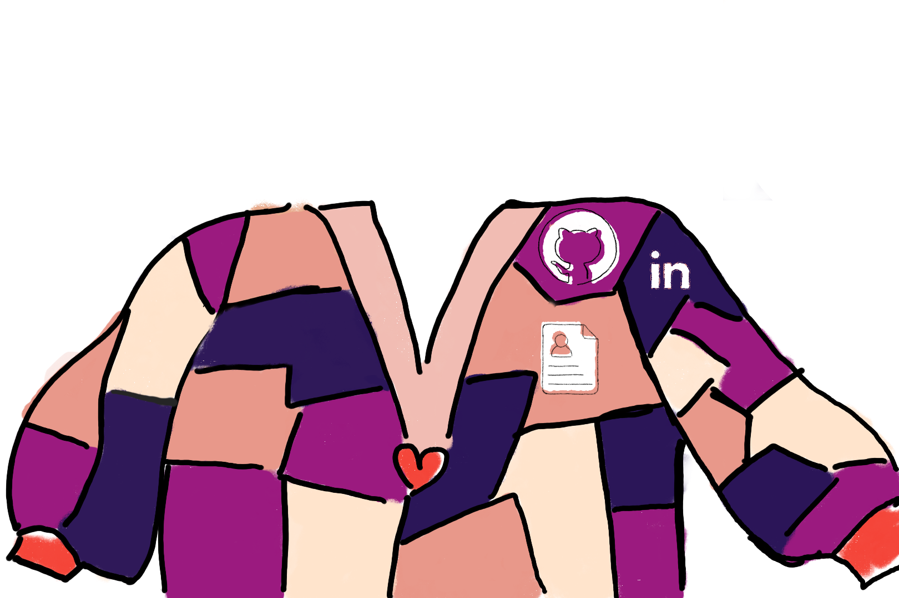

# Ultimate CS girls cardigan
Dear my precious girls, I hope you found this repo well. Today, we are here, united by the divine CS power, to create a cardigan so strong that will wipe away all the fear for assembly.

## Getting Started



1. Clone this repo with 
`git clone https://github.com/ngavu2004/ultimate-CS-girls-cardigan.git`

2. Open terminal, run  `npm install`

2. Open the patches component at `src/app/components/InteractivePatches.tsx`

3. Choose a patch for yourself

4. (optional) Create a branch from main branch with your name

4. Rename the patch after you, for eg, if you choose patch 1, change the code from
```html
<Link href="" id="placeholder1-link" className="patch-link">
    <g className="patch-group">
        <polygon 
        className="patch" 
        points="441.5,393.5 403.5,554 633.5,515.5 579.5,380 441.5,393.5" 
        />
        <text x="520" y="450" className="patch-text">1</text>
    </g>
    </Link>
```

To:
```html
<Link href="" id="placeholder1-link" className="patch-link">
    <g className="patch-group">
        <polygon 
        className="patch" 
        points="441.5,393.5 403.5,554 633.5,515.5 579.5,380 441.5,393.5" 
        />
        <text x="520" y="450" className="patch-text">Your Beautiful Name</text>
    </g>
</Link>
```

5. Run `npm run dev` and open the localhost to make sure the changes are made

6. Do any other addition you like. Some suggestions:
* Add special effect  to your patch (Show your image when hover, glow when hover, etc)
* Add hidden riddle or easter eggs in your patch link

7. Push the changes to github

For any other question, you can definitely reach out to me (If you know the existence of this repo, you are probably in my power puff group chat.)

Love you and hope to see you personality displayed!

